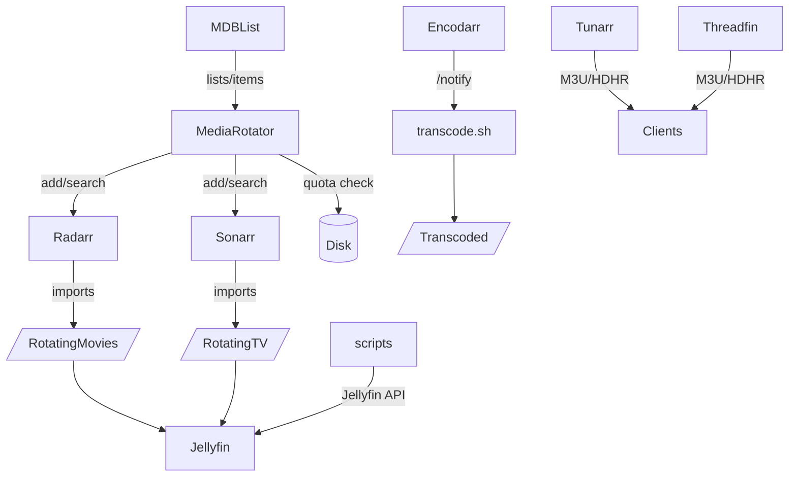

# MediaCycler — Disk-limited media rotation, health and transcoding, and IPTV channeling

## Overview

MediaCycler is a media management suite that rotates libraries under disk quotas, auto-imports from curated lists, checks and transcodes files, and exposes IPTV channels.

**What it does**: MediaCycler provides intelligent media lifecycle management by automatically discovering, importing, and rotating content within defined storage limits. It maintains quality through selective imports, health checks, and on-demand transcoding, while making your media easily accessible through IPTV channel endpoints.

**Key Integrations**: Seamlessly integrates with Radarr, Sonarr, Jellyfin, MDBList, Trakt, Threadfin, Tunarr, and Trailarr to create a complete media automation ecosystem.

**Philosophy**: Import one at a time to maintain quality and storage limits. Make streaming easy via IPTV endpoints. Quality over quantity, with intelligent curation and automatic cleanup to keep your media collection fresh and within disk constraints.

## Key Features

- **Disk quota-aware media rotation (Movies and TV)** with cached import tracking using SQLite database
- **Automated list ingestion from MDBList** "HD Movie Lists" for curated content discovery with fallback to Trakt trending lists
- **Radarr/Sonarr add, search, and cleanup flows** with automatic removal when quota exceeded
- **Health checks of media with ffmpeg** and on-demand transcoding via Encodarr webhook integration
- **Jellyfin utility scripts** including genre tagging from folder layout and collection management
- **IPTV endpoints with Threadfin and Tunarr** for easy streaming access to your media
- **Docker Compose examples** for all services with production-ready configurations

## High-level Architecture

### Data Flow

MediaCycler operates through a coordinated workflow that balances content discovery, storage management, and streaming accessibility:

1. **Content Discovery & Import**: MediaRotator pulls candidates from MDBList curated lists, consults its SQLite cache to avoid duplicates, and strategically adds new content to Radarr/Sonarr under the RotatingMovies/RotatingTV directories.

2. **Quota Management**: When storage exceeds defined thresholds, the quota guard automatically deletes the oldest cached items and removes them from Radarr/Sonarr, ensuring continuous operation within disk limits.

3. **Quality Assurance**: Encodarr webhook receives "needs transcode" events from your media server, runs device-aware transcoding via transcode.sh, and logs all processing outputs for monitoring.

4. **Health Monitoring**: Automated health checks scan media libraries using ffmpeg to detect corruption, format issues, and optimization opportunities.

5. **Streaming Access**: Threadfin and Tunarr provide IPTV-accessible channels that consume content from your media server, making everything available through standard streaming protocols.

### Architecture Diagram



## File and Folder Structure

```
MediaCycler/
├─ README.md
├─ docker-compose.yml          # Root orchestration for all services
├─ .env.example               # Sample environment configuration
├─ Encodarr/
│  ├─ app.py
│  ├─ transcode.sh
│  ├─ media_healthcheck.py
│  ├─ Dockerfile
│  └─ requirements.txt
├─ MediaRotator/
│  ├─ cache.py
│  ├─ mdblist_fetcher.py
│  ├─ radarr_handler.py
│  ├─ sonarr_handler.py
│  ├─ media_rotator.py         # Main CLI script (NEW!)
│  └─ README.md
├─ scripts/
│  ├─ tag_tv_genres.sh         # Now uses env vars (SECURITY FIX)
│  ├─ setup-cron.sh           # Automated cron job setup (NEW!)
│  └─ README.md
├─ threadfin/
│  ├─ docker-compose.yml
│  └─ README.md
├─ trailarr/
│  ├─ docker-compose.yml
│  └─ README.md
├─ tunarr/
│  ├─ README.md (upstream)
│  └─ INTEGRATION.md
└─ docs/
   ├─ CHATGPT_PRIMER.md
   └─ README_TEMPLATE.md
```

## Prerequisites

- **OS**: Linux recommended
- **System packages**: ffmpeg and ffprobe, curl, jq
- **Python 3.10+** with pip
- **Docker and Docker Compose** (for threadfin and trailarr)
- **Node 22, pnpm, and Bun** (for tunarr development usage)

## Installation

### Python Environment Setup

```bash
python3 -m venv .venv
source .venv/bin/activate
pip install flask requests
```

### System Package Installation

#### ffmpeg

- **Debian or Ubuntu**: `sudo apt-get install -y ffmpeg`
- **Arch**: `sudo pacman -S ffmpeg`

#### Docker and Compose

Follow installation instructions per your distribution

#### Node, pnpm, Bun

Follow upstream instructions for Tunarr development usage

## Configuration

Copy `example.env` and set values:

```bash
export RADARR_API_KEY="YOUR_KEY"
export RADARR_URL="http://localhost:7878"
export RADARR_QUALITY_PROFILE_ID="1"

export SONARR_API_KEY="YOUR_KEY"
export SONARR_URL="http://localhost:8989"
export SONARR_QUALITY_PROFILE_ID="1"
export SONARR_LANGUAGE_PROFILE_ID="1"
```

### Notes

- **MediaRotator root folders are currently hard-coded in handlers:**

  - Movies: `/mnt/netstorage/Media/RotatingMovies`
  - TV: `/mnt/netstorage/Media/RotatingTV`
  - If you use different paths, either create symlinks or adjust `radarr_handler.py` and `sonarr_handler.py`.

- **Jellyfin integration requires server URL and token for scripts:**

  - Example variables for `scripts/tag_tv_genres.sh`:
    - `JELLYFIN_URL="http://YOUR_JELLYFIN:8096"`
    - `API_KEY="YOUR_TOKEN"`

- **Encodarr listens on port 8099 and writes to:**

  - Alerts log: `/home/.../encodarr/alerts_log.log` (adjust as needed)
  - Transcoded output: `/mnt/netstorage/Media/Transcoded`
  - transcode.sh path: `/app/transcode.sh` if containerized; otherwise point to `Encodarr/transcode.sh`

- **MDBList pulls from user hd-movie-lists (no API key currently used); fallback to Trakt trending lists requires `TRAKT_CLIENT_ID`.**

## Secrets

Do not commit tokens or keys. Prefer environment exports, process managers, or secret stores. For local development, source `example.env` in your shell session.

### Media Directory Structure

```
/mnt/netstorage/Media/
├── Movies/                  # Primary movie collection (Trailarr)
├── TV/                     # Primary TV collection (Scripts, Trailarr)
├── RotatingMovies/         # 4TB quota-managed movies (MediaRotator)
├── RotatingTV/             # 4TB quota-managed TV shows (MediaRotator)
└── Transcoded/             # Processed media output (Encodarr)
```

### Service Port Allocation

- **Encodarr**: 8099 (Flask API)
- **Threadfin**: 34400 (IPTV proxy)
- **Trailarr**: 7889 (Trailer management)
- **Tunarr Dev**: 8000 (backend), 5173 (frontend)

## Quick Start

### 🚀 New! One-Command Setup

The missing MediaRotator CLI and automated setup scripts are now implemented:

```bash
# 1. Setup environment
cp .env.example .env
# Edit .env with your API keys

# 2. Setup cron jobs automatically
./scripts/setup-cron.sh

# 3. Test MediaRotator (dry run)
python MediaRotator/media_rotator.py --dry-run --add-limit 2

# 4. Start all services via Docker Compose
docker-compose up -d
```

### 🔧 Recent Improvements

- ✅ **MediaRotator CLI implemented** - Main automation script was missing, now complete
- ✅ **Security fix** - Removed hard-coded API key from genre tagging script
- ✅ **Docker typo fixed** - Fixed `unless-stopped` in trailarr configuration
- ✅ **Root orchestration** - Main docker-compose now runs MediaRotator alongside Threadfin, Trailarr, and Encodarr
- ✅ **Automated cron setup** - Script to install scheduled tasks automatically
- ✅ **Environment template** - Complete .env.example with all required variables

### 📋 Service Status Summary

| Component          | Status      | Type        | Notes                                 |
| ------------------ | ----------- | ----------- | ------------------------------------- |
| **Encodarr**       | ✅ Ready    | Always-on   | Flask webhook service for transcoding |
| **Threadfin**      | ✅ Ready    | Always-on   | IPTV proxy via Docker Compose         |
| **Trailarr**       | ✅ Fixed    | Always-on   | Trailer service (typo corrected)      |
| **Tunarr**         | ✅ Ready    | Development | Live TV channels (dev mode ready)     |
| **MediaRotator**   | ✅ Complete | Scheduled   | Main CLI script implemented           |
| **Health Checker** | ✅ Ready    | Scheduled   | Media validation script               |
| **Genre Tagging**  | ✅ Secured  | Interactive | Now uses environment variables        |
| **Transcoding**    | ✅ Ready    | Manual      | Batch processing script               |

## Usage

### End-to-End Component Setup

#### MediaRotator

- Configure Radarr and Sonarr and ensure RotatingMovies and RotatingTV exist.
- Schedule MediaRotator periodically (example: hourly) to import one new title if eligible and rotate if over quota.

#### Encodarr

Start the Flask app:

```bash
cd Encodarr
FLASK_APP=app.py flask run --host 0.0.0.0 --port 8099
```

Send a test notification:

```bash
curl -X POST http://localhost:8099/notify \
  -H "Content-Type: application/json" \
  -d '{"file":"/path/to/media.mkv","video":"hevc","audio":"eac3"}'
```

Check alerts_log.log and the Transcoded output folder.

#### Healthcheck

```bash
python Encodarr/media_healthcheck.py
```

Results written to /mnt/netstorage/Media/bad_files.log

#### Threadfin

```bash
cd threadfin
docker compose up -d
```

UI at <http://localhost:34400>

#### Trailarr

```bash
cd trailarr
docker compose up -d
```

UI at <http://localhost:7889>

#### Tunarr (dev)

```bash
cd tunarr
pnpm turbo dev
```

Backend: <http://localhost:8000>, Web: <http://localhost:5173/web>

### Basic Operations

```bash
# Check service status
docker ps | grep -E "(encodarr|threadfin|trailarr)"

# View service logs
docker logs transcode_notifier
docker logs threadfin
docker logs trailarr

# Test MediaRotator manually
cd MediaRotator
python3 -c "from cache import initialize_cache_db; initialize_cache_db()"
```

### API Examples

```bash
# Encodarr transcoding notification
curl -X POST http://localhost:8099/notify \
  -H "Content-Type: application/json" \
  -d '{
    "file": "/mnt/netstorage/Media/Movies/Example.mkv",
    "video": "h265",
    "audio": "ac3"
  }'

# Check Threadfin status
curl http://localhost:34400/api/status

# MediaRotator cache operations
cd MediaRotator
python3 -c "
from cache import add_to_cache, is_in_cache
add_to_cache('tt1234567', 'movie', 'Example Movie', 'HD List')
print(f'In cache: {is_in_cache(\"tt1234567\")}')
"
```

### Integration Examples

See component-specific READMEs for detailed integration examples:

- [Encodarr Integration](./Encodarr/README.md#integration-examples)
- [MediaRotator Usage](./MediaRotator/README.md#automation--operations)
- [Script Automation](./scripts/README.md#usage)

## Automation / Operations

### Cron Automation Examples

Example cron entries:

```bash
# Run MediaRotator hourly
15 * * * * cd /path/to/MediaCycler && /path/to/.venv/bin/python MediaRotator/media_rotator.py --type movie >> /var/log/mediacycler.log 2>&1
45 * * * * cd /path/to/MediaCycler && /path/to/.venv/bin/python MediaRotator/media_rotator.py --type show >> /var/log/mediacycler.log 2>&1

# Nightly healthcheck
0 3 * * * /path/to/.venv/bin/python /path/to/MediaCycler/Encodarr/media_healthcheck.py >> /var/log/media_healthcheck.log 2>&1
```

**Note**: Provide or implement `MediaRotator/media_rotator.py` if missing.

### Automated Tasks

- **MediaRotator**: Continuous disk space monitoring and content rotation
- **Encodarr**: Real-time transcoding triggered by file system events
- **Genre Tagging**: Batch processing of TV collections in Jellyfin
- **Trailer Updates**: Scheduled trailer acquisition and organization

### Monitoring

```bash
# Service health checks
curl http://localhost:8099/notify -I  # Should return 405 Method Not Allowed
curl http://localhost:34400 -I       # Should return 200 OK
curl http://localhost:7889 -I        # Should return 200 OK

# Disk space monitoring
df -h /mnt/netstorage/Media/Rotating*

# Log monitoring
tail -f /var/log/syslog | grep -E "(docker|media)"
```

### Backup Procedures

```bash
# MediaRotator cache backup
cp ~/.media_rotation_cache.db ~/.media_rotation_cache.db.backup

# Service configuration backup
tar -czf mediaroller-config-$(date +%Y%m%d).tar.gz \
    threadfin/data/conf \
    trailarr/trailarr_data \
    example.env

# Restore configuration
tar -xzf mediaroller-config-YYYYMMDD.tar.gz
```

## Troubleshooting

### Common Issues

#### Radarr or Sonarr 400 responses

- Check API keys and base URLs.
- Confirm quality and language profile IDs exist.

#### Encodarr timeouts

- app.py subprocess timeout is 600 seconds; increase if needed.
- Ensure ffmpeg and ffprobe are installed and on PATH.

#### Healthcheck noise

- Some valid files may log decoder warnings; review stderr contents.

#### Permissions

- Docker bind mounts and host folders require correct PUID and PGID.

#### Services won't start

**Symptoms**: Container exit codes, port binding failures
**Solutions**:

```bash
# Check port availability
sudo netstat -tulpn | grep -E ":8099|:34400|:7889"

# Verify Docker permissions
sudo usermod -aG docker $USER
newgrp docker

# Check volume mount permissions
ls -la /mnt/netstorage/Media/
```

#### Media path not accessible

**Symptoms**: File not found errors, permission denied
**Solutions**:

```bash
# Verify mount point
mount | grep netstorage

# Check directory permissions
sudo chmod -R 755 /mnt/netstorage/Media/
sudo chown -R 1000:1000 /mnt/netstorage/Media/
```

#### API integration failures

**Symptoms**: HTTP 401/403 errors, connection timeouts
**Solutions**:

- Verify API keys in environment variables
- Check service URLs and network connectivity
- Review Radarr/Sonarr API key permissions

### Log Analysis

```bash
# Encodarr transcode logs
grep -i "transcode" /var/log/docker/containers/*/container.log

# MediaRotator import tracking
sqlite3 ~/.media_rotation_cache.db "SELECT * FROM imported_media ORDER BY imported_at DESC LIMIT 10;"

# Docker service logs
docker-compose -f Encodarr/docker-compose.yml logs -f
```

### Debug Mode

```bash
# Enable Flask debug mode (Encodarr)
export FLASK_DEBUG=1
cd Encodarr && python3 app.py

# MediaRotator verbose logging
cd MediaRotator
python3 -c "
import logging
logging.basicConfig(level=logging.DEBUG)
from cache import initialize_cache_db
initialize_cache_db()
"
```

## Testing & Coverage

Run tests for each service with coverage reporting enabled to validate functionality.

```bash
# Python services
pytest --cov --maxfail=1 -q

# Tunarr (Node)
npm test -- --coverage
```

## Security

### Access Control

- **Encodarr /notify endpoint**: Restrict access. Prefer a reverse proxy with auth or bind to localhost.
- **API Key Management**: Store API keys as environment variables or in a secret manager.
- **Script Security**: Review scripts for hard-coded tokens (e.g., tag_tv_genres.sh) and replace with env-based configuration in production.

### Authentication

- **API Keys**: All external service integrations require valid API keys
- **Network Access**: Services bind to all interfaces; use firewall rules for restriction
- **File System**: Media directories require read/write access for service accounts

### Network Security

```bash
# Restrict service access to internal networks
sudo ufw allow from 192.168.0.0/16 to any port 8099
sudo ufw allow from 192.168.0.0/16 to any port 34400
sudo ufw allow from 192.168.0.0/16 to any port 7889
```

### Data Protection

- SQLite cache files stored with restricted permissions (600)
- Configuration files exclude sensitive credentials
- Docker secrets management for API keys in production

### Security Best Practices

- Regular container image updates
- Minimal privilege containers with non-root users
- Network segmentation between services and external access
- Audit logging for all API interactions

## Roadmap

Planned features and improvements:

- [ ] **Q1 2024**: Web-based dashboard for service monitoring
- [ ] **Q2 2024**: Enhanced MediaRotator with multiple quality profiles
- [ ] **Q3 2024**: Automated backup and disaster recovery
- [ ] **Q4 2024**: Kubernetes deployment manifests

## Contributing

1. Fork the repository
2. Create a feature branch: `git checkout -b feature/your-feature`
3. Follow component-specific development guidelines
4. Add tests for new functionality
5. Update documentation for changes
6. Submit a pull request with detailed description

See component READMEs for specific contribution guidelines and testing procedures.

## License

This project is licensed under the MIT License - see [LICENSE](./LICENSE) file for details.

Individual components may have additional license requirements:

- **Tunarr**: zlib license (third-party component)
- **Threadfin**: Check upstream licensing
- **Trailarr**: Check upstream licensing

---

## Acceptance Criteria

- [ ] All services start successfully with example configuration
- [ ] API endpoints respond correctly to health checks
- [ ] Docker Compose deployments work without manual intervention
- [ ] Media paths are accessible and writable by all services
- [ ] Integration with Radarr/Sonarr APIs functions correctly
- [ ] Jellyfin integration processes genre tagging successfully
- [ ] SQLite cache operations complete without errors
- [ ] Backup and restore procedures tested and documented
- [ ] Security measures implemented and network access restricted
- [ ] Performance benchmarks meet expected throughput requirements
